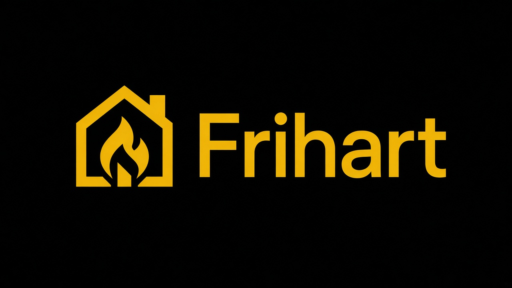

# Frihart

<p align="center">
  
</p>

A **libertarian**, privacy-first web browser written in **Rust**.
Original code. Not a fork of Firefox, LibreWolf, Chromium, or anything
else.

**LibreWolf is the inspiration** — telemetry gone, fingerprinting
resisted, you are sovereign — implemented as native features, not
add-ons. The look is **black chrome, yellow accents**.

Linux desktop is the product — good, stable, and fast before other OS
work. Arch and CachyOS are the reference. Fedora, Mint, Tails, and Qubes
are first-class homes. Other Linux uses the same binary. After that:
other OS and Android, with **special priority** that GrapheneOS, Jolla
(Sailfish), Volla Phone OS, and similar alt phones work great. Windows,
macOS, and stock Android stay parked paid ports until Linux desktop
clears the bar.

This is a long project. The chrome runs. The engine paints a growing
HTML subset. JavaScript is off. That is intentional. Read
[PHILOSOPHY.md](PHILOSOPHY.md) and [ROADMAP.md](ROADMAP.md).

## Why this exists

Firefox and Chrome are attack surfaces the size of an OS: C/C++ memory
corruption, huge IPC, GPU, and JS, plus telemetry and account gravity.
A LibreWolf-style *fork* still rebases that tree.

Frihart starts smaller:

- Rust, so use-after-free is not the weekly news
- Policy before any network or disk write
- Tor tabs that **fail closed** (no clearnet fallback)
- No login vault, no Frihart account, no phone-home
- A documented subset, not a fake "we render the whole web"

We are not "better than Firefox" today. We are building a browser that
is **harder to own**, for people who treat a leak as a failure.

## Repositories

- **Primary:** [codeberg.org/ichbinlucasv/Frihart](https://codeberg.org/ichbinlucasv/Frihart) — issues, PRs, and pushes land here first
- **Mirror:** [github.com/ichbinlucasv/Frihart](https://github.com/ichbinlucasv/Frihart) — sync after Codeberg; do not treat as the source of truth

```bash
git remote add codeberg ssh://git@codeberg.org/ichbinlucasv/Frihart.git   # if missing
git push codeberg main
git push origin main   # GitHub mirror only after Codeberg
```

## Product (Linux)

- Black / yellow chrome (LibreWolf stance, our pixels)
- Identity **containers** in the tab strip (`about:containers`)
- Native **uBlock-class blocker**, on at install (`about:blocker`)
- Built-in **translator**, DeepL default, no Google (`about:translate`)
- Swisscows search, DuckDuckGo second (`about:search`)
- Tor tabs (`--tor`, Ctrl+Shift+O) and I2P tabs (`--i2p`, Ctrl+Shift+I) via your system daemons. Fail closed.
- ProtonVPN / Mullvad CLI hooks (`about:vpn`)
- Wipe / reset / shred this profile only (`about:shred`)
- Identity autofill; **never** a password store (`about:pass`)
- rustls fetch, first-party partitioned cookies, HTTPS-only
- HTML → CSS → layout → display list (`about:engine`)

Linux desktop is free. Non-Linux (including packaged mobile builds —
GrapheneOS / Jolla / Volla / Android / Windows / macOS): **€100
lifetime**, local key, no license server. Voluntary support never unlocks
a privacy tier. See [docs/pricing.md](docs/pricing.md) and
[docs/stance.md](docs/stance.md).

## Linux homes

| Distro | Status |
| --- | --- |
| Arch, CachyOS | Reference. `packaging/arch/PKGBUILD` |
| Fedora | `packaging/fedora/frihart.spec` |
| Mint (Debian/Ubuntu) | `packaging/debian/` |
| Tails | Amnesic default (`--private` unless `--profile`). Use Tails Tor |
| Qubes OS | DisposableVM = private profile. Fedora & Debian template notes |
| Other Linux | Same binary. Wayland first, X11 while it lasts |

Details: [docs/distros.md](docs/distros.md). OPSEC: [docs/opsec.md](docs/opsec.md).

## Current status

**v0.1.0.** Campaigns **A, B, C** (crate phases 0–2) are **closed**.
**D, E, F, G** are open. **H** and **I** are parked.

On Linux, `cargo run` opens a real window. `https://` fetches over rustls
and paints the subset via a sandboxed `--content-worker` (`no_new_privs`
+ landlock + seccomp-bpf + rlimits; in-process fallback if the worker
dies). CSS understands `em`/`rem`, `font-weight`, `border`, `list-style`, and `white-space`. Find
(Ctrl+F) searches the display list. JS is off. `javascript:` is refused.
Tor tabs dial SOCKS only. `about:sites` claims `example.com`, RFC 1918,
suckless.org, GNU philosophy, kernel.org, docs.kernel.org, ietf.org,
the RFC Editor index, w3.org, the W3C TR index, webarch, RFC 9110, WCAG 2.2, RFC 8446 (TLS 1.3), RFC 5280 (X.509), RFC 8032 (Ed25519), RFC 7748 (Curve25519 / X25519), RFC 5869 (HKDF), openbsd.org, openssh.com, libressl.org, openbsdfoundation.org, openbgpd.org, opensmtpd.org, openntpd.org, openiked.org, bearssl.org, wireguard.com, gnupg.org, noiseprotocol.org, curl.se, and signal.org. `about:settings` is the LibreWolf-stance page.
Tracking query keys are stripped. Private-IP redirects are refused.
Content width follows the window up to 2400 CSS px (G9-class). JS is off
on purpose. The engine is Frihart in Rust; we will not embed another
browser's runtime. A script interpreter has not been started.

**CSS claim coverage:** the first subset for the named static list is in
(`list-style`, `white-space`, `font-family` slots, borders, sizes, …).
External CSS on claimed pages is still mostly unused (nav stacks). Details:
[docs/css-subset.md](docs/css-subset.md). How claims are tested:
[docs/testing.md](docs/testing.md).

Next session: [docs/HANDOFF.md](docs/HANDOFF.md).

## Build

Recent stable Rust (`rust-toolchain.toml`) and a Linux desktop (Wayland
or X11).

```bash
cargo build --release
cargo run
```

```bash
cargo run -- about:settings
cargo run -- --private
cargo run -- --tor
cargo run -- --i2p
cargo run -- --install-addon ./some-firefox-addon.xpi
cargo run -- --profile ./profile-dev
```

```
frihart [URL] [--profile PATH] [--private] [--tor] [--i2p] [--version]
```

```bash
cargo test --workspace
cargo fmt --all -- --check
cargo clippy --workspace --all-targets -- -D warnings
```

Pipeline / content / CSS crate filters and claim fixtures:
[docs/testing.md](docs/testing.md).

## Profile

```
$XDG_DATA_HOME/frihart/profiles/default/
    prefs.toml
    bookmarks.toml
    history.jsonl
    user.css          # optional; you create it
    downloads.json
    lock
```

Private windows use memory only. Files are `0600` / dirs `0700`.

## Documentation

| File | What it is |
| --- | --- |
| [PHILOSOPHY.md](PHILOSOPHY.md) | Constitution. Libertarian, LibreWolf stance |
| [docs/stance.md](docs/stance.md) | Compatibility floor, two modes, money, DNS, quantum |
| [docs/community.md](docs/community.md) | Tor/I2P/Monero/GPG/SimpleX — launch, don't embed |
| [ROADMAP.md](ROADMAP.md) | Campaigns A–I and crate phases 0–15 |
| [docs/HANDOFF.md](docs/HANDOFF.md) | Where to continue (A–C closed) |
| [ARCHITECTURE.md](ARCHITECTURE.md) | Crate map |
| [docs/opsec.md](docs/opsec.md) | Standing OPSEC rules |
| [docs/distros.md](docs/distros.md) | Arch, Cachy, Fedora, Mint, Tails, Qubes |
| [docs/engine.md](docs/engine.md) | HTML → display list |
| [docs/css-subset.md](docs/css-subset.md) | CSS we implement vs ignore (honest claim coverage) |
| [docs/testing.md](docs/testing.md) | Workspace, pipeline, content, and CSS tests |
| [docs/sites.md](docs/sites.md) | Claimed static documents (`about:sites`) |
| [branding/README.md](branding/README.md) | Canonical lockup + icon (`frihart-lockup.png`) |
| [docs/defaults.md](docs/defaults.md) | Every shipped default and why |
| [docs/packaging.md](docs/packaging.md) | How to package |
| [CONTRIBUTING.md](CONTRIBUTING.md) | How to work on the tree |
| [SECURITY.md](SECURITY.md) | Threat model and reporting |

## License

MIT OR Apache-2.0. You own what you run.

## Name

Frihart is the name of the browser. It is not a reskin and it does not
stand for an acronym.
